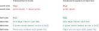
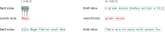
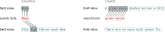
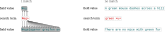

= Further Explanations

== LexCQL

=== Relations and their Modifiers

This section provides further explanations and example-oriented illustrations of the relations `=` (xref:sec-se[xrefstyle=short]) and `==` (xref:sec-ese[xrefstyle=short]) defined in <<sec-lexcql-relations>>, as well as their changing behavior with different modifiers (e.g. xref:sec-ese-regex-specialchar[xrefstyle=short]) applied.

Although there are term-only queries, the illustrations in this chapter always show only the terms (red) to demonstrate matching against the field values (green), and not complete queries, as this would only be valid for the `=` relation, but not for the `==` relation.

[discrete]
==== Untokenised and Tokenised Form

To understand the function of the relations and their modifiers, it is important to understand the difference between untokenised and tokenised forms, which apply to the content of a search term or field value. xref:fig-untokenized-and-tokenized-form[xrefstyle=short] illustrates the difference between untokenised and tokenised form of terms and fields. The example terms and field values are then used in the following sections to illustrate the concrete matching mechanisms of search terms and field values according to the used relations and relation modifiers.

.Terms and fields in untokenised and tokenised form
[#fig-untokenized-and-tokenized-form,discrete]

The tokenised form of a term or field value is the result of a tokenisation process, which splits the content into smaller units (tokens) according to certain rules. The untokenised form is the original content without any splitting. As result, the tokenised form may contain multiple tokens, either in terms or in field values (e.g., "green mouse" is tokenised into "green" and "mouse") and results in a set of tokens, while the untokenised form is a fixed sequence of characters. The matching of search terms and field values can be performed on either the untokenised or tokenised form, depending on the specified relation and its modifiers.

[#sec-se,discrete]
==== `=` (equality)

Using the `=` relation, the search term, split into tokens, is matched against the field value in its tokenised form. The matching is performed on a token-by-token basis, and the search term matches the field value if all tokens of the search term are found in the field value, regardless of their order or position.

.The `=` relation uses tokenised form for matching.

Another noticeable aspect of the `=` relation is that it allows for normalisation of the search term and field value, such as case-insensitivity or base form matching, depending on the server's implementation. This means that the search term "mouse" may match a field value "Mouse" or "mice".

The `=` relation is the default relation for term-only queries (i.e., queries without an explicit relation, e.g., `green mouse`), which are translated to a tokenised lookup in the field _lemma_ (i.e., `lemma = "green mouse"`). It provides a flexible matching mechanism that can accommodate variations in spelling, capitalisation, and other factors and therefore is recall-oriented.

[#sec-ese,discrete]
==== `==` (exact equality)

Using the `==` relation, the search term is matched against the field value in its untokenised form. The matching is performed on the entire string, and the search term matches the field value only if they are exactly equal, including order and position of characters. That's why in xref:fig-ese[xrefstyle=short] the only match is on field value "Wege". All other matches would be partial matches, which are not supported.

.The `==` relation uses untokenised form for matching.
[#fig-ese,discrete]

[#sec-ese-regex,discrete]
==== `==/regexp` (exact equality with regular expression modifier)

Using the `==` relation with the regular expression modifier (`regexp`), the search term is matched against the field value in its untokenised form, but the search term is interpreted as a regular expression. This allows for more flexible matching patterns, such as prefixes, suffixes, or complex character sequences.

It is important to understand that simply using this relation modifier without any Regex-specific control characters changes the matching behaviour in such a way that the `==` relation no longer has to match the entire field value, but now allows partial matches. This is because Regex itself specifies mechanisms for explicitly querying _at the start_ (`^`) or _at the end_ (`$`), which are intended to be supported in order to realise the full potential of exact full matches and partial matches.

.The `==` relation with regular `regexp` modifier allows for partial matches.
[#fig-ese-regex,discrete]

[#se-specialchar,discrete]
==== `=` (equality with special characters)

Using special characters (<<sec-lexcql-relation-modifiers>>) in the search term with the `=` relation, the search term is interpreted as a pattern that can match multiple field values, depending on the specific special characters used. The matching is performed on the tokenised form of the field value, and the search term matches if it satisfies the pattern on at least one token of the field value.

.The `=` relation with special character `*` allows for flexible matching patterns.
[#fig-se-specialchar,discrete]

As seen in xref:fig-se-specialchar[xrefstyle=short] above, special characters can significantly alter the matching behaviour of the `=` relation. To demonstrate that better, we introduce another German example field value "Wegelagerer greifen an" (English: "Highwaymen attack") and show how the search term `Weg*` matches it, because it looks up tokens starting with "Weg" followed by none or any characters, which applies to the token "Wegelagerer" in the field value.

NOTE: As the use of the `=` relation allows for normalisation – such as searching for the base form of a word – this can lead to results that are technically correct but not self-explanatory to users. In the example above, the search term `\*u*` is used. The illustration shows a hit for the token "fur". Strictly speaking, however, "mice" should also be marked as a hit here, as the base form "mouse" contains a "u" and therefore fulfils the conditions of the pattern. Nevertheless, it is immediately apparent that the result is not entirely self-explanatory when searching for _generic_ patterns – such as, in this case, all tokens containing "u" anywhere – than when searching for `mouse`, in which case it is easier to understand why "mice" appears in the results.

[#sec-ese-specialchar,discrete]
==== `==` (exact equality with special characters)

Using the same examples as in xref:se-specialchar[xrefstyle=short], the `==` relation with special characters is illustrated in xref:fig-ese-specialchar[xrefstyle=short]. The first example searches the term `Weg*` and matches the field values "Weg" and "Wegelagerer greifen an", as it searches the entire field value in its untokenised form; the search term is considered a match because it begins with "Weg" and is followed by either no characters or any characters in the entire string. The second example doesn't match at all, as both field values do not start with a "g".

.The `==` relation with special character `*` allows for flexible matching patterns on entire field values.
[#fig-ese-specialchar,discrete]

[#sec-ese-regex-specialchar,discrete]
==== `==/regexp` (exact equality with regular expression modifier and special characters)

In direct comparison with the previous xref:sec-ese-specialchar[xrefstyle=short], regular expression special characters are now used in combination with the `regexp` modifier; this allows more complex search patterns to be formulated, whilst also removing the requirement for the `==` relation that a match must be found across the entire field value.

This is illustrated in the second example in xref:fig-ese-regex-specialchar[xrefstyle=short], which uses the same search term as before: `green.*u`. However, as partial matches are now possible, the search for `green` followed by any number of arbitrary characters, followed by a `u`, matches "green mou" in one of the example sentences and "green fu" in the other.

.The `==` relation with `regexp` modifier and special characters `.` and `*` allows for precise pattern based partial matches.
[#fig-ese-regex-specialchar,discrete]

Nevertheless, it is still possible to use the regular expression special characters `^` and `$` to formulate search patterns that are evaluated at the start, at the end, or from start to end of the field value. See the following examples for illustration

. Pattern from start: `^A` matches "A" at the beginning of field values "Alle Wege führen nach Rom" and "A green mouse dashes across a hill"
. Pattern from end: `.ill$` matches "hill" at the end of field value "A green mouse dashes across a hill"
. Pattern from start to end: `^A.*ill$` matches "A green mouse dashes across a hill" from start to end of the field value.

=== Query Examples

This section contains sample queries with detailed explanations of the semantics they express and the specific LexCQL features used.

* `lemma == "lead" AND definition = "river"`
+
Entries whose lemma is exactly "lead" and whose definition contains the token "river".

* `lemma == "drive*" AND pos is VERB`
+
Entries whose lemma begins with "drive" and are verbs according to the definition of the <<ref:UD,Universal Dependencies project>>. Query omits default namespace `https://universaldependencies.org/u/pos/` for field `pos`.

* `lemma = "seal" AND (pos is NOUN OR pos is "https://universaldependencies.org/u/pos/PROPN")`
+
Entries whose lemma contains the token "seal" which are either noun or a proper noun (or both) according to the definition of the <<ref:UD,Universal Dependencies project>>. Query uses namespaces both implicitly and explictly and changes evaluation order with parentheses.

* `lemma = "seal" AND pos is NOUN OR pos is "https://universaldependencies.org/u/pos/PROPN"`
+
Entries whose lemma contains the token "seal" and which are nouns, or entries that are proper nouns, or entries that are both. Query is evaluated left to right.

* `lemma ==/lang=de/ignoreCase/ignoreAccents "Grüße" OR definition =/regexp "^[Gg]r(ue|ü|u)[sßz]+e$"`
+
Entries whose lemma is in German language and matches "Grüße" (including all variations in terms of capitalisation and accents), or whose definition contains a token matching a regular expression that captures various spelling variants, or both.

* `synonym ==/regexp "^car"`
+
Entries that have a synonym with the prefix "car".

* `lang == de AND translation ==/lang=en car`
+
Entries in German language that translate to "car" in English.
